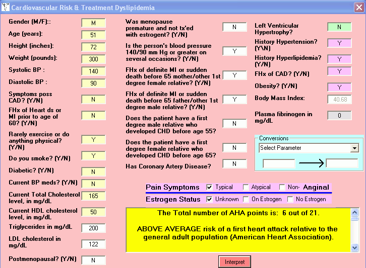



## Cardiovascular Risk

### Description

This is one of many of my medical artificial intelligence programs.  Yes I know this isn't what you might consider AI, but I do.  The program combines a bunch of algorithms to generate an interpretation of CV risk based upon history, BP and lipid levels.  I've included the xls files from the Medical Algorithms web site for your interest (that is why the project is so big-sorry).  The logic is intermediate while the programming beginners and it is not commented.
 
### More Info
 
I suggest you use the tab-stops to scroll through your answers in that order as I haven't debugged every direction that data is entered.

An interpretation of your risk of dying from a heart attack.

Needs error checking.

             |
---                |---
**Submitted On**   |2005-01-10 04:30:46
**By**             |[Warren Goff](https://github.com/Planet-Source-Code/PSCIndex/blob/master/ByAuthor/warren-goff.md)
**Level**          |Intermediate
**User Rating**    |4.8 (19 globes from 4 users)
**Compatibility**  |VB 3\.0, VB 4\.0 \(16\-bit\), VB 4\.0 \(32\-bit\), VB 6\.0
**Category**       |[Complete Applications](https://github.com/Planet-Source-Code/PSCIndex/blob/master/ByCategory/complete-applications__1-27.md)
**World**          |[Visual Basic](https://github.com/Planet-Source-Code/PSCIndex/blob/master/ByWorld/visual-basic.md)
**Archive File**   |[Cardiovasc1838631102005\.zip](https://github.com/Planet-Source-Code/warren-goff-cardiovascular-risk__1-58211/archive/master.zip)

### API Declarations

Nope

